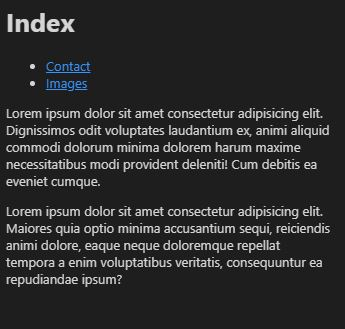

# Nome do projeto

> A small and simple HTML project putting into practice basic knowledge about tags, fundamentals, hyperlink, semantics, attributes and among other concepts. In this project I also learned how to correctly organize an HTML structure, so that it benefits from ranking by search engines.
